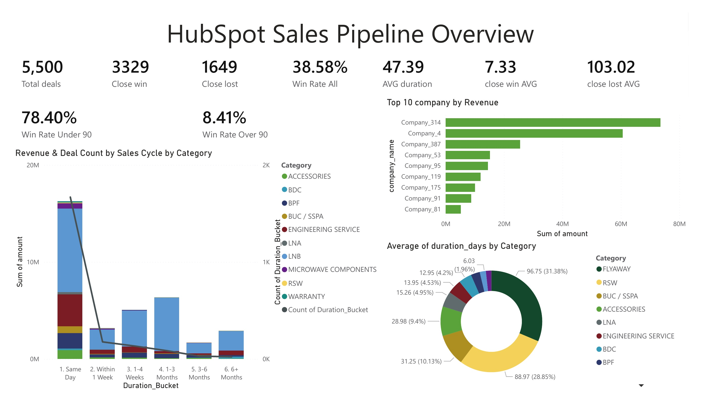
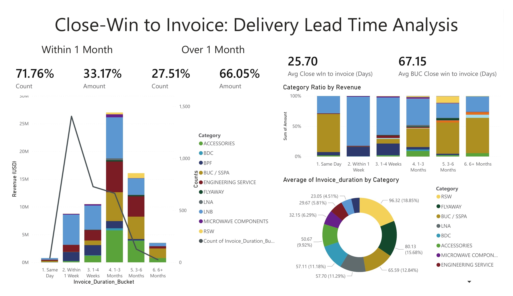
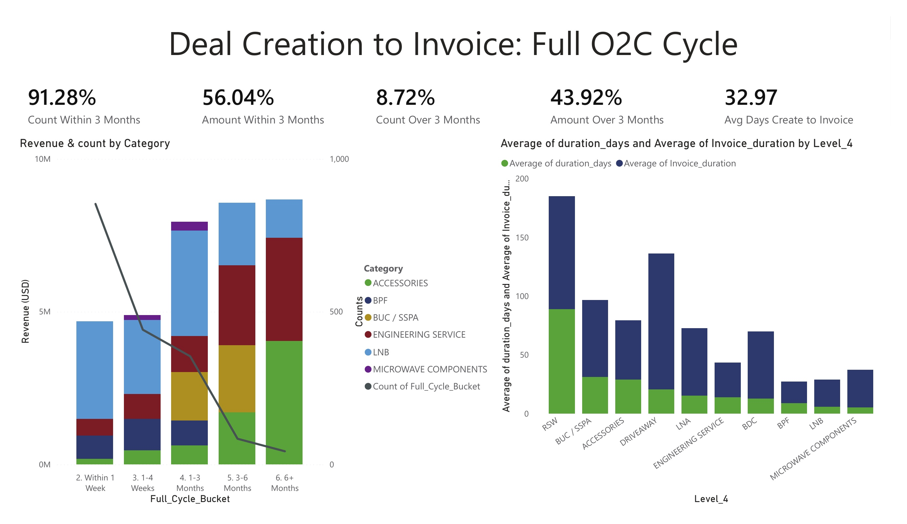
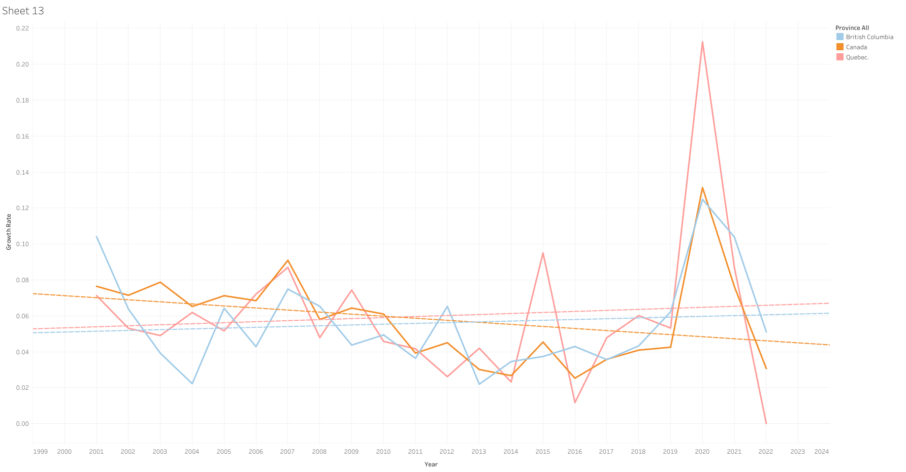

# Seokhyun (Sean) Yoon – Data Analyst Portfolio

📧 seokhyun.sean.yoon@gmail.com · 💼 [LinkedIn](https://www.linkedin.com/in/seokhyun-yoon-241a61104/) · 📄 [Resume](Sean%20Resume.pdf)

---

## About Me

I'm a Statistics grad from Simon Fraser University with a few years of hands-on experience turning messy business data into something useful — whether that's a revenue pipeline, a risk model, or a dashboard a VP can actually read.

My background is a mix of traditional analytics (R, SQL, Excel) and more engineering-leaning work like building API pipelines and automating workflows with Python and GitHub Actions. I've worked with real CRM data (HubSpot, Zoho), cloud warehouses (Snowflake), and ML libraries from scikit-learn to XGBoost and PyTorch.

I'm drawn to B2B and SaaS environments where there's real operational complexity — deals, pipelines, churn, and the gap between what the CRM says and what's actually happening.

---

## Projects

| # | Project | What it does | Tech Stack |
|---|---------|--------------|------------|
| 01 | [HubSpot × Business Central O2C Pipeline](01_HubSpot_BC_O2C_Pipeline/) | Automated API sync between HubSpot CRM and Business Central ERP; scheduled daily via GitHub Actions | Python, REST APIs, GitHub Actions, python-dotenv |
| 02 | [Canadian Health Spending – dbt + Snowflake](02_Health_Spending_dbt_Snowflake/) | End-to-end data pipeline from raw CIHI data to Tableau dashboard; per-capita spending by province 2000–2022 | dbt Cloud, Snowflake, Tableau Public |
| 03 | [Credit Risk ML Pipeline](03_Credit_Risk_ML/) | Loan default prediction with FICO-style scoring (300–850), SHAP explainability, and $10.3M estimated loss prevention | Python, XGBoost, SHAP, scikit-learn, Jupyter |

---

## Project Highlights

### 01 · HubSpot × Business Central O2C Pipeline

This one started as an internal proposal to automate a manual order-to-cash reconciliation process using Azure Logic Apps. After presenting the initial design to leadership, it grew into a broader conversation about Dataverse integration across the company — the scope expanded from one team's workflow to a potential company-wide data layer connecting CRM, ERP, and finance.

The version in this repo is the Python-based implementation: a scheduled pipeline that pulls deal and order data from HubSpot and syncs it to Business Central via REST APIs, running daily on GitHub Actions with secrets managed through environment variables.

**Key finding:** Deals that followed the full O2C pipeline (proper stage progression, linked to BC orders) closed at a **78% win rate**. Deals that skipped stages or were never linked to an order closed at **~8%**. That gap drove the push to formalize the process.

### Dashboard Preview

| Page 1 – Sales Pipeline | Page 2 – Delivery Lead Time | Page 3 – Full O2C Cycle |
|---|---|---|
|  |  |  |

→ [View project folder](01_HubSpot_BC_O2C_Pipeline/)

---

### 02 · Canadian Health Spending – dbt + Snowflake

Built a multi-layer dbt pipeline on top of CIHI's national health expenditure data. The staging model handles messy source data (missing values encoded as "—", inconsistent types), and the mart layer aggregates spending per capita by province and category for Tableau consumption.

Notable: Quebec's spending growth pattern is structurally different from BC and Ontario, something that's hard to see in the raw tables but obvious once you model it properly.

| Spending by Category & Total Trend | YoY Growth Rate |
|---|---|
|  |  |

→ [View project folder](02_Health_Spending_dbt_Snowflake/) · [Tableau dashboard](https://public.tableau.com/app/profile/seokhyun.yoon/viz/Book2_17542733788110/Story3) · [dbt + Snowflake repo](https://github.com/SeanYooon/snowflake_dbt)

---

### 03 · Credit Risk ML Pipeline

End-to-end pipeline covering EDA, feature engineering, XGBoost modeling with SMOTE, and a logistic scorecard transformation that maps default probabilities to a 300–850 FICO-style scale. SHAP is used for both global and per-decision explanations.

The model hit AUC 0.937 on hold-out and automated 85% of approval decisions, with an estimated $10.3M in prevented losses on the portfolio. Designed with Basel III and SR 11-7 principles in mind — not just optimizing for accuracy but making sure the model can actually be audited.

| Performance Dashboard | Model Interpretability |
|---|---|
|  |  |

→ [View project folder](03_Credit_Risk_ML/)

---

## Education

**Simon Fraser University** — B.Sc. Statistics, December 2023

## Certifications

- IBM Data Science Professional Certificate (Dec 2023)
- Deep Learning Specialization – DeepLearning.AI (Oct 2024)
- Tableau for Data Analytics – LinkedIn Learning (Jan 2023)
