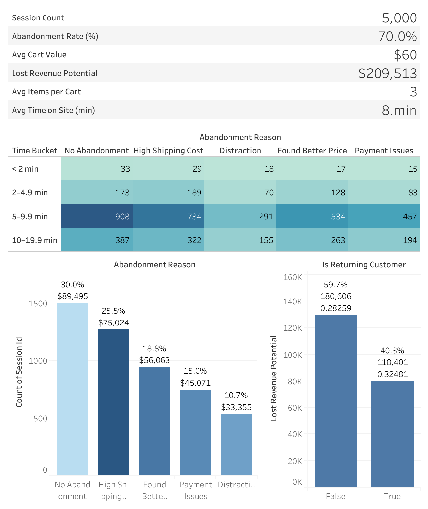

# Seokhyun Yoon – Data Analyst Portfolio

## 👋 About Me

Hello, I'm Seokhyun Yoon — a Statistics graduate from Simon Fraser University with a strong foundation in data analysis, machine learning, and business intelligence tools.

I specialize in applying predictive modeling, time series forecasting, classification algorithms, and dashboarding to solve real-world business challenges in areas such as customer retention, credit risk, digital marketing ROI, and geospatial insights.

I work primarily with **Python, R, SQL, Power BI, Tableau**, and version control tools like Git. My goal is to transform complex data into actionable insights and data products that help stakeholders make better decisions.

This repository showcases selected projects that demonstrate my technical proficiency, business thinking, and ability to deliver data-driven solutions.

✍️ [View My Resume (PDF)](https://github.com/SeanYooon/Data-Analysis-Portfolio-/blob/main/Sean%20Resume.pdf)
🔗 [Visit My LinkedIn](https://www.linkedin.com/in/seokhyun-yoon-241a61104/)

---

## 📁 Table of Contents

* [👋 About Me](#-about-me)
* [📊 Project Portfolio](#-project-portfolio)

  * [Cart Abandonment - Executive Dashboard](#cart-abandonment--executive-dashboard)
  * [Credit Risk Prediction & Scoring](#credit-risk-prediction--scoring-banking-grade-ml-pipeline)
  * [Customer Churn Prediction Dashboard](#customer-churn-prediction-dashboard)
  * [Ad Campaign ROAS Analysis](#ad-campaign-roas-analysis)
  * [SpaceX Falcon 9 Landing Prediction](#spacex-falcon-9-landing-prediction)
  * [Housing Price Prediction](#housing-price-prediction)
  * [Rainfall Forecasting (Time Series)](#rainfall-forecasting-time-series)
  * [Police Complaints Prediction](#police-complaints-prediction)
  * [Health Spending Visualization (Canada)](#health-spending-visualization-canada)
  * [Insurance Cost Analysis (Excel)](#insurance-cost-analysis-excel)

---

## 📊 Project Portfolio
---
### Cart Abandonment – Executive Dashboard

**Business Goal:**  
Identify key drivers of online cart abandonment and quantify lost revenue potential to support e-commerce conversion optimization strategies.

* **Tech Stack:** PostgreSQL, Tableau Public, Excel  
* **Key Actions:**  
  - Imported raw e-commerce session data (5,000 sessions) into PostgreSQL and created KPI summary tables.  
  - Engineered features such as **Abandoned Flag**, **Lost Revenue Potential**, **Time Buckets**, and customer segmentation fields (Returning vs New, Coupon Used).  
  - Built an executive KPI dashboard showing abandonment rate, average cart value, session totals, and lost revenue potential.  
  - Analyzed **abandonment reasons** (High Shipping Cost, Payment Issues, etc.) and their financial impact.  
  - Segmented performance by **time spent on site** and **customer type** to identify behavioral differences.  

* **Results:**  
  - Found **70% abandonment rate**, representing **$209K in lost revenue potential** across 5,000 sessions.  
  - High shipping cost was the **largest abandonment driver**, linked to ~$75K in lost revenue.  
  - First-time customers had significantly **lower conversion rates** than returning customers (only ~28% of cart value converted).  
  - Sessions lasting **over 5 minutes** were strongly correlated with successful conversions.  
  - Coupons showed **limited effect** on reducing abandonment, suggesting greater ROI from pricing or loyalty strategies.  

* **Visuals:**  

| KPI Overview | 
|--------------|
|  

* **Files:**  
- [`cart_abandonment.csv`](files/cart_abandonment.csv) – Dataset  

* **Link:**  
- [View Tableau Dashboard](https://public.tableau.com/views/CartAbandonment_17561755499880/Dashboard1?:language=en-US&:sid=&:redirect=auth&:display_count=n&:origin=viz_share_link)

* **Source:**
[E-Commerce Card Abandonment](https://www.kaggle.com/datasets/ritalin56/e-commerce-card-abandonment))
---
## Credit Risk Prediction & Scoring (Banking-Grade ML Pipeline)

##  Overview

This project is an end-to-end credit risk analytics pipeline built for banking applications.  
It predicts loan default, transforms outputs into FICO-style 300–850 credit scores, applies the 5 Cs of Credit assessment, and quantifies business impact ($10.3M loss prevented).  
**Key features:** regulatory-ready interpretability (SHAP), business rule integration, and professional-grade performance reporting.

## Tools & Libraries

- **Python** (pandas, numpy, scikit-learn, XGBoost, imblearn)
- **Visualization:** matplotlib, seaborn, SHAP
- **Notebook:** Jupyter

## Process

1. **Exploratory Data Analysis (EDA)**
   - Outlier detection, missing value imputation, feature-target relationships
2. **Feature Engineering**
   - Debt-to-income ratio, home ownership flags, employment length
3. **Model Development**
   - XGBoost with hyperparameter tuning (RandomizedSearchCV)
   - SMOTE for class imbalance
4. **Credit Scoring**
   - Logistic scorecard transformation (PDO=50, base odds=1:9, 300–850 scale)
5. **5 Cs of Credit Assessment**
   - Character, Capacity, Capital, Collateral, Conditions
6. **Interpretability**
   - SHAP feature importance and individual prediction explanations
7. **Performance Reporting**
   - ROC, PR curve, confusion matrix, business impact summary

##  Key Results

- **Hold-out AUC:** 0.937 (exceeds industry standard)
- **Default Detection Rate:** 76.4%
- **Loss Prevented:** \$15.6M (portfolio estimate)
- **Approval Automation:** 85%
- **Top Risk Factors:** Home ownership, loan grade, DTI, income, loan purpose

##  Visualizations

| Performance Dashboard                             | Model Interpretability          |
|-------------------------------------------------------|--------------------------------------------|
|    |  |

##  Banking & Regulatory Context

- **FICO-Equivalent Scoring:** 300–850 scale, points-to-double-odds (PDO=50)
- **5 Cs of Credit:** Integrated into decision logic
- **Model Interpretability:** SHAP values for global & local explainability
- **Regulatory Alignment:** Basel III, SR 11-7, and Fair Lending (ECOA) principles followed
- **Business Impact:** Quantified loss prevention, approval automation, and risk tiering

##  Business Impact Summary

- **Loss Prevention:** $10.3M in prevented defaults (estimate)
- **Detection Rate:** 76.4% of defaults identified
- **Approval Automation:** 85% of applications processed automatically

##  Source

- [Kaggle: Credit Risk Dataset](https://www.kaggle.com/datasets/laotse/credit-risk-dataset)

##  Files

- [`credit_risk.ipynb`](/files/credit_risk.ipynb) – full notebook

---
###  Ad Campaign ROAS Analysis

**Business Goal:** Analyze and compare the Return on Ad Spend (ROAS) across multiple ad platforms to identify the most cost-effective marketing channels.

* **Tech Stack:** Excel, Tableau, Power BI, SQL 
* **Key Actions:**
  * Collected and organized campaign data across Facebook, Google, and YouTube ads
  * Calculated ROAS, CTR, CPC, and CPM metrics for each campaign and platform
  * Created custom visuals to compare KPIs, cost distribution, and performance trends
  * Delivered dashboard and presentation highlighting the highest and lowest performing channels
  * Suggested reallocation strategies for future ad budgets based on findings

* **Results:**  
  * Identified Google Ads as highest ROAS (~ 3.5x), while YouTube underperformed (<1x)  
  * Found a clear inverse relationship between ad cost and effectiveness on certain platforms  
  * Supported marketing team in shifting budget to high-ROI channels and pausing weak performers

* **Visuals:**

| ROAS by Channel                            |  Cost Effectiveness Comparison         |
|-------------------------------------------------------|--------------------------------------------|
|    |  |

* **Files:** 
- [`Ad_Campaign_ROAS_Report.pdf`](files/Ad_Campaign_ROAS_Report.pdf) 
---

###  SpaceX Falcon 9 Landing Prediction

**Business Goal:** Predict booster landing success to support mission planning and reduce launch failure risks.

* **Tech Stack:** Python, Pandas, Scikit-learn, Plotly Dash, Folium, SQL  
* **Key Actions:**
  * Pulled and cleaned SpaceX API data; added features via scraping (e.g., booster version)
  * Conducted EDA with SQL, time series, and categorical visualizations
  * Built interactive dashboard (Dash) and geographic map (Folium)
  * Trained and compared classifiers (Logistic Regression, SVM, Decision Tree)

* **Results:**  
  * Found strong correlations between orbit type and landing success  
  * Identified an increasing success trend with higher flight numbers  
  * Delivered an interactive tool for launch analysis and planning

* **Visuals:**

| Interactive Launch Map (Folium)                         | Model Accuracy Chart                          |
|---------------------------------------------------------|-----------------------------------------------|
|                     |  |

* **Files:**  

- [`SpaceX_Machine_Learning_Prediction.ipynb`](files/SpaceX_Machine_Learning_Prediction_Part_5.jupyterlite.ipynb) – full Jupyter notebook  
- [`falcon9.pdf`](files/spacex-final.pdf) – final PDF summary
---
### Housing Price Prediction

**Business Goal:** Predict home prices from large-scale Connecticut housing data.

* **Tech Stack:** R, XGBoost, glmnet, tidyverse
* **Key Actions:**

  * Cleaned and transformed 995K+ sales records
  * Tuned XGBoost model with interaction terms and log scaling
* **Results:**

  * RMSE = 1.15; top features include location and assessed value

* **Visuals:**
  
| Feature Importance | Actual vs Predicted        |
|-------------------------------------------------------|--------------------------------------------|
|   |  |

---
###  Rainfall Forecasting (Time Series)

**Business Goal:**  
Forecast monthly rainfall in Perth, Australia to support weather planning and hydrology management using long-term seasonal patterns.

* **Tech Stack:**  
  R, `forecast`, `tseries`, `ggplot2`, Box-Jenkins Methodology

* **Key Actions:**  
  * Loaded and cleaned 106 months of historical rainfall data  
  * Conducted stationarity checks and seasonal decomposition  
  * Performed grid search to optimize SARIMA parameters based on AIC  
  * Trained SARIMA(1,0,0)(0,1,1)[12] model to forecast 14 future months  
  * Compared against a dynamic regression model with covariates  
  * Validated forecasts against actual rainfall from BOM (Australia)

* **Results:**  
  * Achieved >10% improvement in accuracy after model refinement  
  * Detected strong annual seasonality in rainfall patterns  
  * Delivered an interpretable model with clear confidence intervals  
  * Highlighted SARIMA as effective for mid-term weather forecasting

* **Visuals:**
 
| SARIMA Forecast | Residual Autocorrelation Plot         |
|-------------------------------------------------------|--------------------------------------------|
| |  |

* **Files:**
  
- [`Rainfall.Rmd`](rainfall_forecasting.Rmd) – full notebook
- [`IDCJAC0009_009021_1800_Data.csv`](data/rainfall.csv) – historical rainfall data  
- [`images/rainfall_forecast.pdf`](images/rainfall_forecast.pdf) – forecast plot  
- [`images/residual_acf.pdf`](images/residual_acf.pdf) – residual autocorrelation chart
- [`Rainfall_Report.pdf`](files/485_Project_Report_Official.pdf) - Rainfall report 

---

### Health Spending Visualization (Canada)

**Business Goal:** Deliver an interactive, per-capita breakdown of Canadian provincial health expenditures (2000–2022) to inform public policy and budget planning.

- **Tech Stack:**  
  -  dbt Cloud (Snowflake) for SQL modeling & testing  
  -  Tableau Public for dashboarding  
  -  CIHI Open Data for raw health spending & population  
- **Data Pipeline:**  
  1. **Raw ingestion** of CIHI HEALTH_SPENDING_RAW via `sources.yml`  
  2. **Staging model** (`stg_health_spending.sql`)  
     - Converts “—” and empty strings to NULL  
     - Casts `POPULATION_K`, `SPENDING` to float  
     - Calculates `spending_per_capita` and prior-year spending (`prev_spending_pc`)  
     - Filters out nulls to enforce data quality  
  3. **Mart model** (`mart_health_spending.sql`)  
     - Aggregates by `province`, `year`, `category`  
     - Computes total spending and average per-capita metrics  
  4. **Automated tests** in `schema.yml` to ensure no nulls in key fields  

- **Visuals:**

| Stacked Bar + Dot Line – Spending by Category and Total Trend                              | Line Chart – YoY Growth Rate (Canada vs Quebec vs BC)         |
|-------------------------------------------------------|--------------------------------------------|
| |  |

- **Results & Impact:**  
  - Revealed Quebec’s unique spending growth patterns  
  - Highlighted per-capita efficiency differences across provinces  
  - Provided stakeholders an accessible, visual tool for health budget comparisons  

- **Files:**  
  - SQL models & tests in the [snowflake_dbt repo](https://github.com/SeanYoooon/snowflake_dbt)  
  - Exported CSV for Tableau Public:  ['Cleaned_health_spending_population_combined.xlsx']('files/Data/Cleaned_health_spending_population_combined.xlsx') 
  - Tableau workbook: `Health_Spending_Canada.twbx` (published to Tableau Public) : [Tableau Public](https://public.tableau.com/app/profile/seokhyun.yoon/viz/Book2_17542733788110/Story3)

- **Data Source:**  

* [National Health Expenditure (NHEX) 2024 – Full Data Tables](https://www.cihi.ca/sites/default/files/document/nhex-2024-full-data-tables-en.xlsx)

- **Github Repo**
[1] GitHub -[https://github.com/SeanYooon/Data-Analysis-Portfolio-](https://github.com/SeanYooon/snowflake_dbt)

---
### Insurance Cost Analysis (Excel)

**Business Goal:** Simulate group benefits cost modeling.

* **Tech Stack:** Excel, Pivot Tables, VBA
* **Key Actions:**

  * Built age-tiered risk model using Excel formulas and macros
  * Automated premium segmentation and risk profiling
* **Results:** Dashboard visualizing smoker cost impact, family size premiums, and risk categories

---

## 🎓 Education

**Simon Fraser University** — Burnaby, BC
**Bachelor of Science in Statistics*
*Graduated: December 2023*

---

## 📜 Certificates

* [IBM Data Science Professional Certificate](https://www.coursera.org/account/accomplishments/specialization/XQD6FNV9Q5FB) (Dec 2023)
* [Deep Learning Specialization – DeepLearning.AI](https://coursera.org/share/HROP8FKWDLCK) (Oct 2024)
* [Tableau for Data Analytics – LinkedIn Learning](https://www.linkedin.com/learning/certificates/814d91fd0c6ab19bb16c9d29fd23fb3a7915ad908637ed0b5ba19f5684ac1dc5) (Jan 2023)

---

## 📬 Contact

* 📧 Email: [seokhyun.sean.yoon@gmail.com](mailto:seokhyun.sean.yoon@gmail.com)
* 💼 LinkedIn: [Seokhyun\_Yoon](https://www.linkedin.com/in/seokhyun-yoon-241a61104/)

---

## 📌 Tools Summary 

## 🛠️ Tools & Project Usage

| Tool       | Used In Projects                      |
|------------|---------------------------------------|
| Python     | Credit Risk, Churn, SpaceX, ROAS      |
| R          | Rainfall, Housing, Police             |
| Power BI   | Churn, ROAS                           |
| Tableau    | Health Spending, ROAS                 |
| Excel      | Insurance, ROAS                       |
| Snowflake  | Heart Disease, Health Spending        |
| dbt Cloud  | Heart Disease, Health Spending        |
