# Seokhyun Yoon – Data Analyst Portfolio

## 👋 About Me

Hello, I'm Seokhyun Yoon — a Statistics graduate from Simon Fraser University with a strong foundation in data analysis, machine learning, and business intelligence tools.

I specialize in applying predictive modeling, time series forecasting, classification algorithms, and dashboarding to solve real-world business challenges in areas such as customer retention, credit risk, digital marketing ROI, and geospatial insights.

I work primarily with **Python, R, SQL, Power BI, Tableau**, and version control tools like Git. My goal is to transform complex data into actionable insights and data products that help stakeholders make better decisions.

This repository showcases selected projects that demonstrate my technical proficiency, business thinking, and ability to deliver data-driven solutions.

✍️ [View My Resume (PDF)](https://github.com/SeanYooon/Data-Analysis-Portfolio-/blob/600ea4af8f841bf852fe868ec03f4e31772f46f97/Sean%20Resume.pdf)
🔗 [Visit My LinkedIn](https://www.linkedin.com/in/seokhyun-yoon-241a61104/)

---

## 📁 Table of Contents

* [👋 About Me](#-about-me)
* [📊 Project Portfolio](#-project-portfolio)

  * [Credit Risk Prediction & Scoring](#credit-risk-prediction--scoring)
  * [Customer Churn Prediction Dashboard](#customer-churn-prediction-dashboard)
  * [Marketing Campaign ROAS Optimization](#marketing-campaign-roas-optimization)
  * [SpaceX Falcon 9 Landing Prediction](#spacex-falcon-9-landing-prediction)
  * [Housing Price Prediction](#housing-price-prediction)
  * [Rainfall Forecasting (Time Series)](#rainfall-forecasting-time-series)
  * [Police Complaints Prediction](#police-complaints-prediction)
  * [Health Spending Visualization (Canada)](#health-spending-visualization-canada)
  * [Insurance Cost Analysis (Excel)](#insurance-cost-analysis-excel)

---

## 📊 Project Portfolio

### Credit Risk Prediction & Scoring

**Business Goal:** Predict default risk to improve loan decisions and reduce losses.

* **Tech Stack:** Python, XGBoost, SHAP, SMOTE, Seaborn, Scikit-learn
* **Key Actions:**

  * Built credit scoring pipeline with 300–850 scale transformation
  * Applied class imbalance handling (SMOTE) and model tuning
  * Used SHAP for explainability and compliance
  * Quantified potential financial loss savings
* **Results:**

  * 93.7% AUC; 76.4% detection rate
  * Estimated \$10.3M in loss prevention
 
 * **Visuals:**

| Performance Dashboard                             | Model Interpretability          |
|-------------------------------------------------------|--------------------------------------------|
|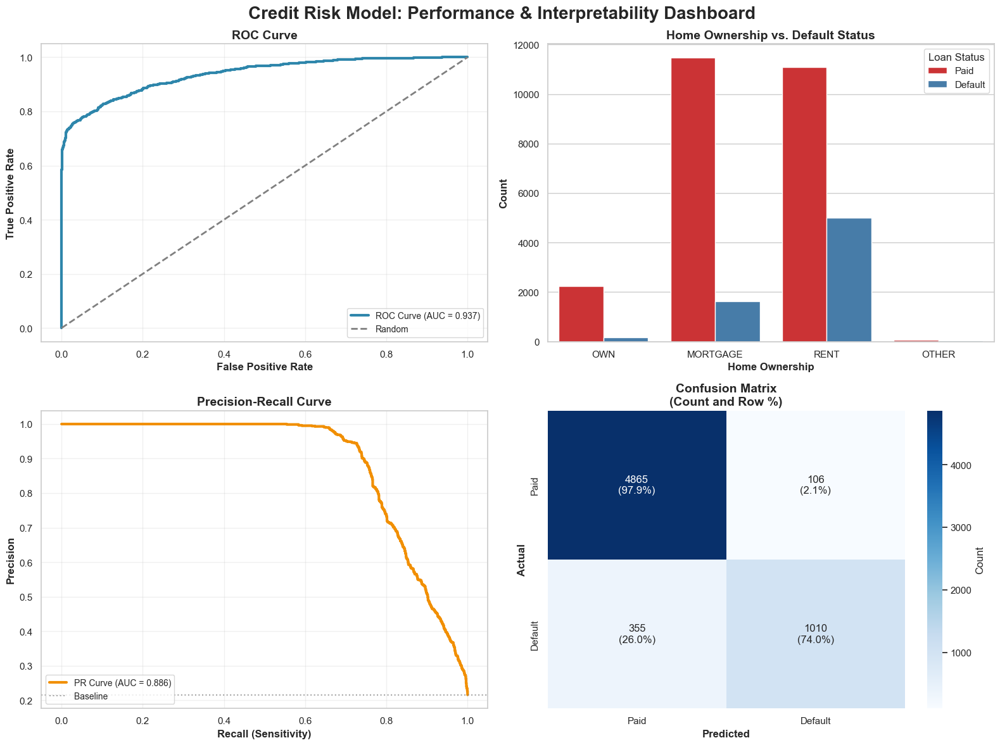    | 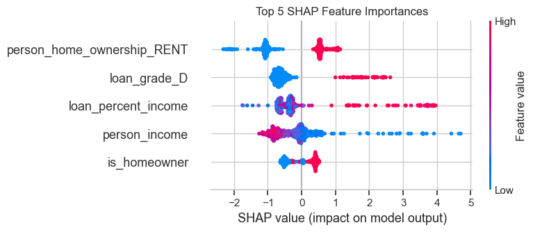 |

---
### Customer Churn Prediction Dashboard

**Business Goal:** Identify and prevent customer churn with predictive analytics and dashboards.

* **Tech Stack:** Python, PyTorch, SMOTE, Tableau, Scikit-learn
* **Key Actions:**

  * Built a neural network churn model (\~79% accuracy)
  * Visualized KPIs and churn factors in Tableau dashboard
  * Conducted OLAP-style segmentation on tenure, contract type, etc.
 
* **Results:** Enabled proactive targeting of high-risk segments

* **Visuals:**

| KPI: Churn Rate | Churn by Internet Service |
|----------------|---------------------------|
| 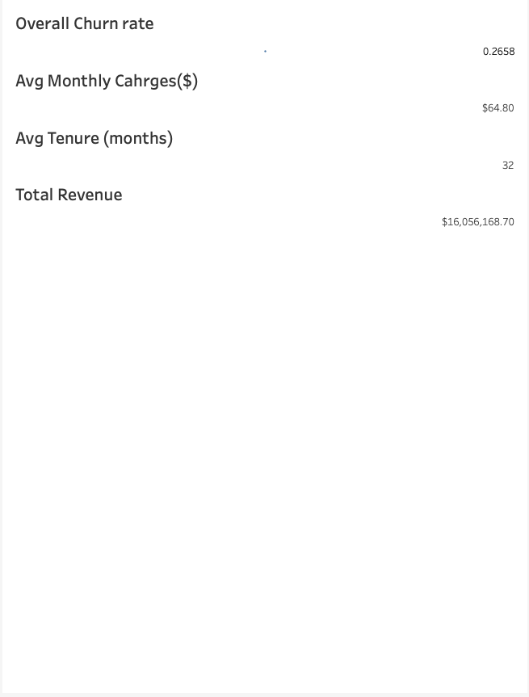 | 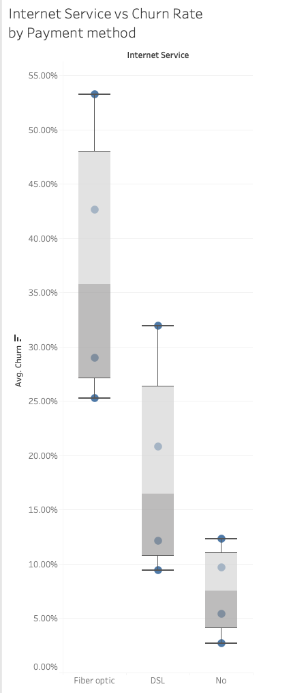 |

---
### Marketing Campaign ROAS Optimization

**Business Goal:** Improve digital marketing ROI by predicting and explaining ROAS drivers.

* **Tech Stack:** Python, XGBoost, Seaborn, Pandas
* **Key Actions:**

  * Preprocessed data and created custom metrics (e.g., Impressions per Dollar)
  * Removed outliers for better model generalization
  * Trained and interpreted XGBoost regression
* **Results:**

  * R² improved to 0.9280 post outlier removal
  * Key drivers identified: Conversion Rate, Age, Impressions efficiency

* **Visuals:** 

| Model Analysis                            | Actual vs Predicted           |
|-------------------------------------------------------|--------------------------------------------|
|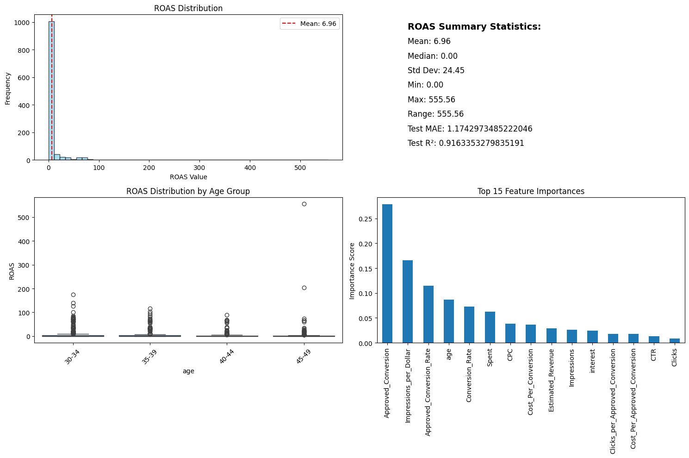    | 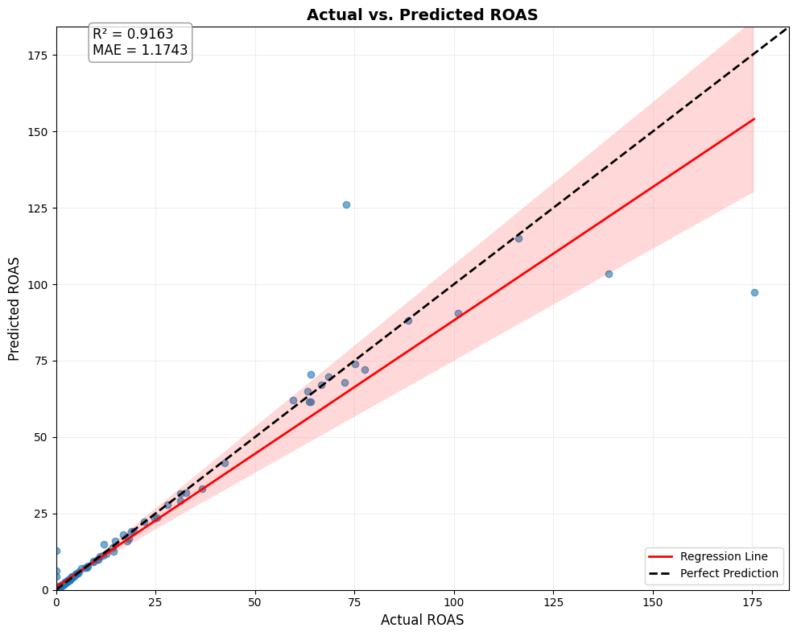 |

---
---

### 🚀 SpaceX Falcon 9 Landing Prediction

**Business Goal:** Predict booster landing success to support mission planning and reduce launch failure risks.

* **Tech Stack:** Python, Pandas, Scikit-learn, Plotly Dash, Folium, SQL  
* **Key Actions:**
  * Pulled and cleaned SpaceX API data; added features via scraping (e.g., booster version)
  * Conducted EDA with SQL, time series, and categorical visualizations
  * Built interactive dashboard (Dash) and geographic map (Folium)
  * Trained and compared classifiers (Logistic Regression, SVM, Decision Tree)

* **Results:**  
  * Found strong correlations between orbit type and landing success  
  * Identified an increasing success trend with higher flight numbers  
  * Delivered an interactive tool for launch analysis and planning

* **Visuals:**

| Interactive Launch Map (Folium)                         | Model Accuracy Chart                          |
|---------------------------------------------------------|-----------------------------------------------|
| 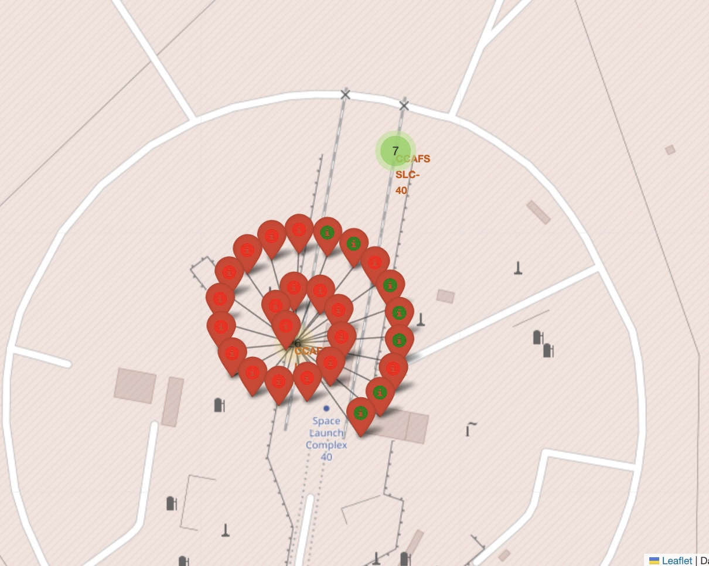                    | 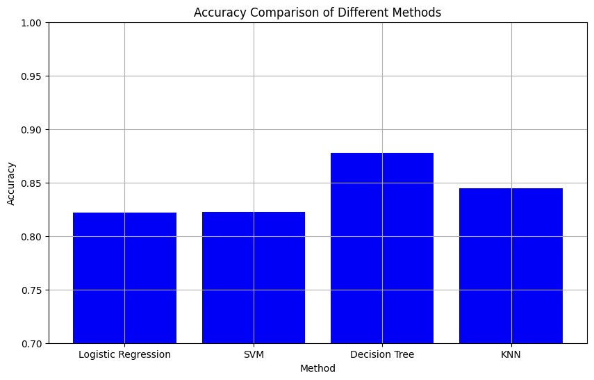 |

* **Files:**  
  `spacex_final.ipynb`, `spacex_dashboard.py`, `spacex_map.ipynb`, `spacex_sql_queries.sql`, `spacex_model_results.png`
---
### Housing Price Prediction

**Business Goal:** Predict home prices from large-scale Connecticut housing data.

* **Tech Stack:** R, XGBoost, glmnet, tidyverse
* **Key Actions:**

  * Cleaned and transformed 995K+ sales records
  * Tuned XGBoost model with interaction terms and log scaling
* **Results:**

  * RMSE = 1.15; top features include location and assessed value

* **Visuals:**
  
| Actual vs Predicted                               | Feature Importance          |
|-------------------------------------------------------|--------------------------------------------|
|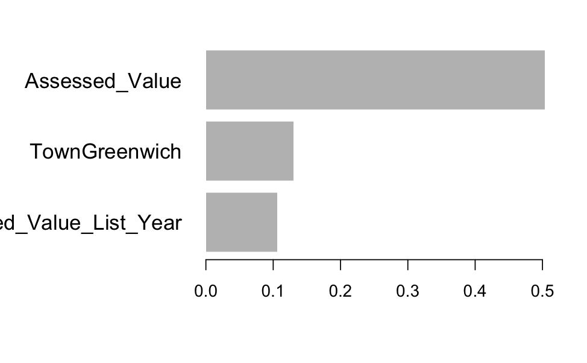   | 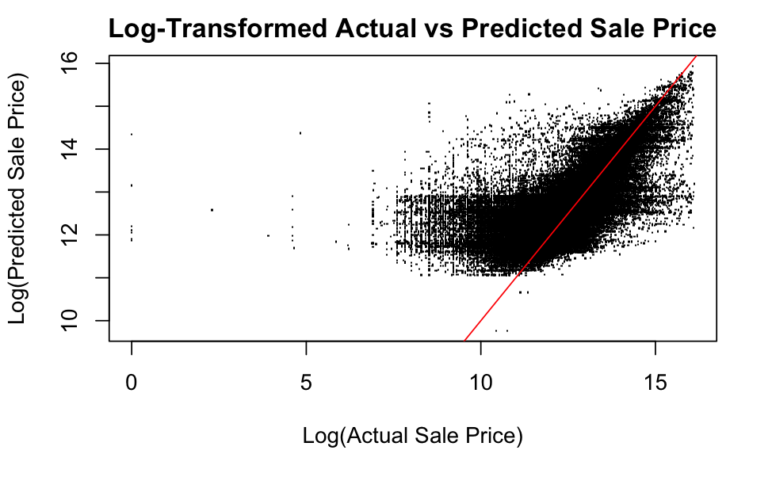 |

---
### Rainfall Forecasting (Time Series)

**Business Goal:** Forecast rainfall to aid in public resource planning.

* **Tech Stack:** R, forecast, ggplot2, Box-Jenkins (SARIMA)
* **Key Actions:**

  * Diagnosed seasonality and stationarity issues
  * Fitted SARIMA(1,0,0)x(0,1,1)\[12] using AIC tuning
* **Results:**

  * RMSE = 1.095; tight forecast confidence intervals

 
| Forecast Plot                                | Residual ACF          |
|-------------------------------------------------------|--------------------------------------------|
|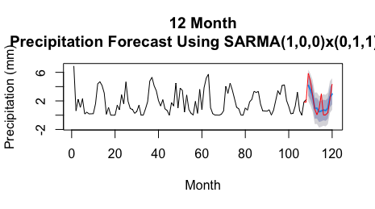 | 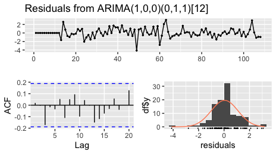 |

---
### Police Complaints Prediction

**Business Goal:** Predict misconduct complaints among officers using historical data.

* **Tech Stack:** R, XGBoost, Random Forest, ROC curves
* **Key Actions:**

  * Modeled likelihood of complaints from demographic/service history
  * Addressed fairness/ethics concerns in model usage
* **Results:** High-AUC classifiers with ethical lens
---
### Health Spending Visualization (Canada)

**Business Goal:** Analyze per-capita and categorical health spending across provinces.

* **Tech Stack:** Tableau, CIHI datasets
* **Key Actions:**

  * Cleaned and integrated population and health funding data
  * Calculated per capita and YoY growth rates
* **Results:** Interactive dashboard revealing policy trends by region
 

| Stacked Bar + Dot Line – Spending by Category and Total Trend                              | Line Chart – YoY Growth Rate (Canada vs Quebec vs BC)         |
|-------------------------------------------------------|--------------------------------------------|
|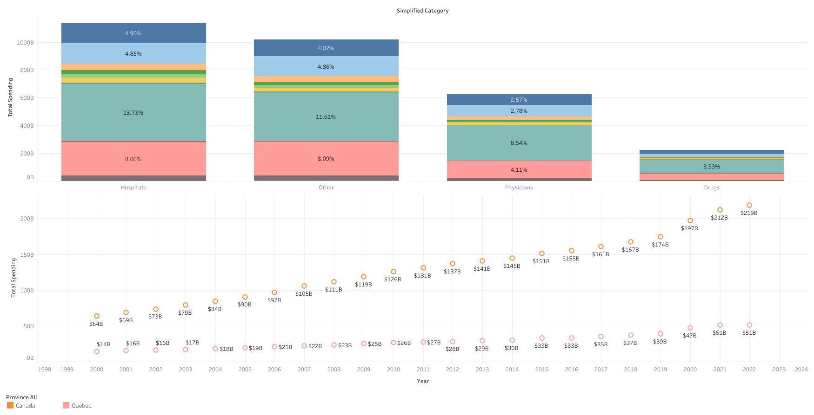 |  |

---
### Insurance Cost Analysis (Excel)

**Business Goal:** Simulate group benefits cost modeling for Sun Life-like scenarios.

* **Tech Stack:** Excel, Pivot Tables, VBA
* **Key Actions:**

  * Built age-tiered risk model using Excel formulas and macros
  * Automated premium segmentation and risk profiling
* **Results:** Dashboard visualizing smoker cost impact, family size premiums, and risk categories

---

## 🎓 Education

**Simon Fraser University** — Burnaby, BC
Bachelor of Science in Statistics
*May 2018 – December 2023*

---

## 📜 Certificates

* [IBM Data Science Professional Certificate](https://www.coursera.org/account/accomplishments/specialization/XQD6FNV9Q5FB) (Dec 2023)
* [Deep Learning Specialization – DeepLearning.AI](https://coursera.org/share/HROP8FKWDLCK) (Oct 2024)
* [Tableau for Data Analytics – LinkedIn Learning](https://www.linkedin.com/learning/certificates/814d91fd0c6ab19bb16c9d29fd23fb3a7915ad908637ed0b5ba19f5684ac1dc5) (Jan 2023)

---

## 📬 Contact

* 📧 Email: [seokhyun.sean.yoon@gmail.com](mailto:seokhyun.sean.yoon@gmail.com)
* 💼 LinkedIn: [@Seokhyun\_Yoon](https://www.linkedin.com/in/seokhyun-yoon-241a61104/)
