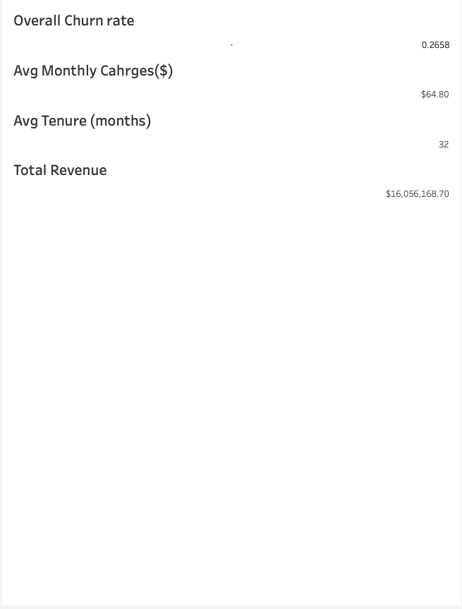
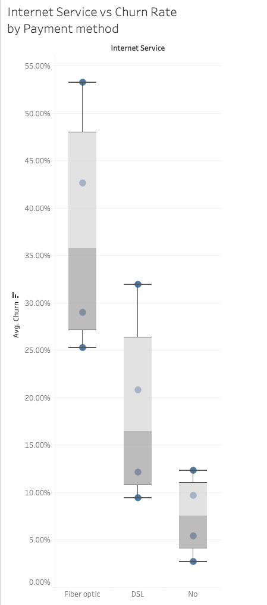

# Seokhyun Yoon - Data Analyst Portfolio

## 👋 About Me

Hello, I'm Seokhyun Yoon — a Statistics graduate from Simon Fraser University with a strong foundation in data analysis, machine learning, and business intelligence tools.

I’ve developed hands-on projects applying predictive modeling, time series analysis, and classification algorithms to real-world problems such as rainfall forecasting, housing price prediction, and rocket landing success rates.

I work primarily with **Python, R, SQL, Power BI, Tableau**, and version control tools like Git. I enjoy simplifying complex data into actionable insights and visual stories that help people make better decisions.

This repository showcases selected projects reflecting my technical skill set and ability to turn raw data into practical outcomes.  
📄 [View My Resume (PDF)]([Sean Resume.pdf](https://github.com/SeanYooon/Data-Analysis-Portfolio-/blob/600ea4aff841bf852fe868ec03f4e31772f46f97/Sean%20Resume.pdf))  
🔗 [Visit My LinkedIn](https://www.linkedin.com/in/seokhyun-yoon-241a61104/)

Let’s connect!

---

## 📁 Table of Contents

- [About](#about)
- [Portfolio Projects](#portfolio-projects)
  - Python
    - [SpaceX Falcon 9 Landing Prediction](#SpaceX-Falcon-9-Landing-Prediction)
    - [Marketing Campaign ROAS Prediction](#marketing-campaign-roas-prediction)
  - R
    - [Housing Price Prediction](#housing-price-prediction)
    - [Police Complaints Prediction](#police-complaints-prediction)
    - [Rainfall Time Series Forecasting](#rainfall-time-series-forecasting)
- [Education](#education)
- [Certificates](#certificates)
- [Contact](#contact)

---

## 📊 Portfolio Projects

Here are some projects I've completed, along with brief descriptions of the tools, goals, and results.

## SpaceX Falcon 9 Landing Prediction 
  ##– Classification + Mapping

## 📊 Project Overview
Predicted the landing success of SpaceX Falcon 9 first-stage boosters using a classification model. Combined machine learning with geospatial visualizations and API-sourced launch data to explore how mission factors influence outcomes.

## 🔧 Tools & Techniques
Python, Pandas, Scikit-learn, Folium, Plotly, SpaceX API  
Classification (Logistic Regression, SVM, Random Forest), Feature Engineering, API Integration

## 🧠 Key Steps
- Scraped and queried launch data via the SpaceX REST API  
- Cleaned and transformed features (e.g., payload mass, orbit, site ID)  
- Engineered new features like payload class and binary landing outcome  
- Built and compared classification models: Logistic Regression, SVM, Random Forest  
- Evaluated models using accuracy, precision, confusion matrix  
- Created an interactive landing site map using Folium

## ✅ Results
- **Best model:** Random Forest Classifier (Accuracy ~87%)  
- **Top predictive features:** Launch Site, Payload Mass, Orbit  
- Created an interactive dashboard to visualize outcomes by location

## 📊 Visuals

| Landing Outcome Map (Folium)                              | Feature Importance          |
|-------------------------------------------------------|--------------------------------------------|
|  |  |

## 📂 Files
- [`SpaceX_Machine_Learning_Prediction.ipynb`](files/SpaceX_Machine_Learning_Prediction_Part_5.jupyterlite.ipynb) – full Jupyter notebook  
- [`falcon9.pdf`](files/spacex-final.pdf) – final PDF summary

---
## Marketing Campaign ROAS Prediction – Regression & Feature Optimization

## 📊 Project Overview
Built an XGBoost regression model to predict Return on Ad Spend (ROAS) using marketing campaign data. The goal was to support budget allocation decisions by identifying which campaign factors most significantly influence ad effectiveness. Outlier handling, feature engineering, and model interpretation were key components.

## 🔧 Tools & Techniques
Python, Pandas, Scikit-learn, XGBoost, Seaborn, Matplotlib
Regression Modeling, Outlier Detection, Feature Importance, MAE/R² Evaluation

## 🧠 Key Steps
1. **Data Preprocessing**
   - Removed currency symbols and standardized numeric columns
   - Converted `Duration` from text to numeric
   - One-hot encoded categorical features such as `Channel_Used`, `Location`, and `Language`

2. **Feature Engineering**
   - Created new features:
     - `Approved_Conversion_Rate`
     - `Impressions_per_Dollar`
     - `Cost_per_Approved_Conversion`

3. **Outlier Handling**
   - Detected heavy-tailed ROAS distribution using box plots and histograms
   - Removed top 1% ROAS outliers for model robustness and better generalization

4. **Modeling**
   - Trained XGBoost Regressor with GridSearchCV tuning
   - Evaluated model using R² and MAE metrics
   - Compared performance **with** and **without** outlier removal

## 📈 Results

| Condition             | R² Score | MAE    |
|-----------------------|----------|--------|
| With Outliers         | 0.9163   | 1.1743 |
| Without Outliers      | 0.9280   | 0.5912 |

> Removing outliers significantly improved model accuracy and reduced error.

## 📊 Visuals

| Model Analysis - with outlier                              | Actual vs Predicted - with outlier          |
|-------------------------------------------------------|--------------------------------------------|
|)   |  |
| Model Analysis - without outlier                              | Actual vs Predicted - without outlier          |
|   |  |

## 🔍 Feature Importance (Top 5)

1. `Approved_Conversion`
2. `Impressions_per_Dollar`
3. `Approved_Conversion_Rate`
4. `age`
5. `Conversion_Rate`

These features showed strong predictive power, helping to explain variations in ROAS across different campaigns.

## 🧠 Insights & Business Impact

- Campaigns with high `Approved_Conversion` and efficient `Impressions_per_Dollar` tend to yield higher ROAS.
- Target age group and conversion efficiency significantly affect return.
- Cleaning data and removing noise (outliers) can enhance business decision-making by producing more stable models.

## ✅ Conclusion

This project demonstrates how machine learning can support digital marketing by:

- Forecasting ROAS
- Identifying key drivers of campaign profitability
- Reducing waste on underperforming segments

The model is highly interpretable, accurate, and ready for use in ad performance dashboards or media planning tools.

## 📂 Files
- [`ad-campaign-roas-optimizer.ipynb`](ad-campaign-roas-optimizer.ipynb) – full notebook
- [`conversion_data.csv`](files/conversion_data.csv) – orignial data
- images/ - Visual assets used in README and notebook

📚 Data Source
**Source:** [Kaggle - Clicks and Conversion Tracking](https://www.kaggle.com/datasets/loveall/clicks-conversion-tracking)

📓 [View Jupyter Notebook](ad-campaign-roas-optimizer.ipynb)

---

## Housing Price Prediction – Connecticut Home Sales (2019–2020)

## 📊 Project Overview
Predicted residential housing prices in Connecticut using a dataset of 995,000+ property sales. Built a regression model using XGBoost, with focus on data cleaning, feature engineering, and model tuning.

## 🔧 Tools & Technologies
R, XGBoost, tidyverse, glmnet, ranger, LightGBM, data.table

## 🧠 Key Steps
- Cleaned and prepared ~1M records from 2019–2020
- Created new time-based and interaction features
- Handled missing values through median/monthly imputation
- Applied log transformation to reduce skew
- Tuned XGBoost with randomized search + early stopping

## 📈 Results
- **Validation RMSE:** 1.15  
- **Validation R²:** 0.26  
- Top features: Assessed value, Town (Greenwich), interaction terms

## 📊 Visuals

| Actual vs Predicted                               | Feature Importance          |
|-------------------------------------------------------|--------------------------------------------|
|   |  |

## 📂 Files
- [`Housing-price-prediction.Rmd`](/files/Housing-price-prediction.Rmd) – full notebook
- [`testing_data.csv`](data/Xte.csv) – Test feature set (for prediction)
- [`testing_data.csv`](data/Xtr.csv) – Training feature set
- [`testing_data.csv`](data/Ytr.csv) – Training labels (house prices)
- [`pred0.csv`](data/pred0.csv) – Output predictions on `Xte`
- [`Rainfall_Report.pdf`](files/485_Project_Report_Official.pdf) - Rainfall Project Report

---

## Police Complaints Prediction

**Code:**  
- [`Final_Version.R`](https://github.com/jasondang01/440module2-jason-tyler-sean/blob/main/Final_Version.R)

**Goal:** Predict which CPD officers would receive complaints in 2015–2016 using data from 2000–2014.

**Description:** Modeled officer misconduct likelihood based on salary, prior complaints, and service data. Explored fairness and ethical data analysis.

**Skills:** Data cleaning, feature engineering, classification, ROC analysis  
**Tech Stack:** R, ggplot2, dplyr, tidyr, randomForest, XGBoost, pROC

**Results:** Built accurate classifiers using Random Forest and XGBoost. Evaluated models with AUC and ROC metrics.

---

## Rainfall Forecasting – Time Series Analysis (Perth, Australia)

## 📊 Project Overview
Forecasted monthly rainfall totals in Perth using a SARIMA model trained on 106 months of historical weather data. Applied time series modeling techniques (Box-Jenkins methodology) to capture seasonality and make future projections.

## 🔧 Tools & Techniques
- R, `forecast`, `tseries`, `ggplot2`
- SARIMA modeling
- Box-Jenkins methodology
- Residual diagnostics (ACF/PACF)
- Forecast validation against real data

## 🧠 Key Steps
- Loaded and cleaned 106 months of historical rainfall data
- Conducted stationarity tests and seasonality checks
- Ran a grid search over SARIMA configurations with AIC optimization
- Selected SARIMA(1,0,0)x(0,1,1)[12] based on lowest AIC
- Forecasted 14 future months (months 107–120)
- Validated predictions against real airport rainfall data
- Sourced rainfall data from the Australian Bureau of Meteorology (BOM) official dataset
- Compared SARIMA model against a dynamic regression benchmark with external covariates

## 📈 Results
- **Model used:** SARIMA(1,0,0)x(0,1,1)[12]
- **Forecasted range:** Months 107–120
- **RMSE:** 1.095  
- **MAE:** 0.863  
- **95% CI coverage:** Forecasts closely followed actual values

## 📊 Visuals
| Forecast Plot                                | Residual ACF          |
|-------------------------------------------------------|--------------------------------------------|
| |  |

## 📂 Files
- [`Rainfall.Rmd`](rainfall_forecasting.Rmd) – full notebook
- [`IDCJAC0009_009021_1800_Data.csv`](data/rainfall.csv) – historical rainfall data  
- [`images/rainfall_forecast.pdf`](images/rainfall_forecast.pdf) – forecast plot  
- [`images/residual_acf.pdf`](images/residual_acf.pdf) – residual autocorrelation chart
- [`Rainfall_Report.pdf`](files/485_Project_Report_Official.pdf) - Rainfall report 

---
## Customer Churn Analysis & Prediction Dashboard

This project simulates a full analytics pipeline to analyze customer churn behavior using OLAP-style exploration, predictive modeling with PyTorch, and an interactive Tableau dashboard.

### 🚀 Overview

This project aims to identify key drivers of customer churn in a telecom company and provide business-friendly insights using statistical analysis and machine learning. The project demonstrates:

- Data cleaning and warehouse-style dimensional modeling  
- OLAP exploration (churn rates by contract, internet service, tenure, etc.)  
- Predictive churn classification using a neural network (PyTorch)  
- Key KPIs and trends visualized using Tableau  

### 🧰 Tools Used

- **Python** (pandas, PyTorch, scikit-learn, SMOTE)  
- **Tableau Public** for dashboards  
- **GitHub** for version control and documentation  

### 🔍 OLAP-Style Exploration Highlights

- **Churn Rate by Contract Type**  
  Compared churn rates across `Month-to-month`, `One year`, and `Two year` contracts.  
  → Found that short-term (Month-to-month) customers churned the most.

- **Churn by Internet Service**  
  Analyzed churn by service type: `DSL`, `Fiber optic`, or `No internet`.  
  → Fiber optic users had the highest churn rate.

- **Churn by Tenure Group**  
  Created tenure buckets: `0–12m`, `13–24m`, `25–48m`, `49–72m`.  
  → Longer-tenure customers churned significantly less.

- **Monthly Charges Bucket Analysis**  
  Grouped customers into pricing tiers: `Low`, `Medium`, `High`.  
  → Higher monthly charges correlated with higher churn.

### 🤖 Predictive Modeling

The churn classification model was built in PyTorch and achieved:

- **Accuracy:** ~79%  
- **F1-score for churners:** ~0.58  
- Applied class imbalance handling using SMOTE and weighted loss

### 📈 Tableau Dashboard

The dashboard summarizes churn performance and customer segmentation using KPI cards and bar charts.

| KPI: Churn Rate | Churn by Internet Service |
|----------------|---------------------------|
|  |  |

### 📂 Files  
- [`churn_analysis.ipynb`](files/Churn.ipynb) – Notebook  
- [`cleaned_telco_churn.csv`](files/cleaned_telco_churn.csv) – Dataset
- [`Original_churn_data.csv`](files/WA_Fn-UseC_-Telco-Customer-Churn_(1).csv) – Dataset 

### 📚 Data Source

- [Telco Customer Churn Dataset (IBM Sample)](https://www.kaggle.com/datasets/blastchar/telco-customer-churn)

### 🔗 View Project

GitHub Repo: [Customer Churn Dashboard](https://github.com/SeanYooon/telco-churn-analysis/blob/main/README.md)

---

## 🎓 Education

**Simon Fraser University** — Burnaby, BC  
Bachelor of Science in Statistics  
*May 2018 – December 2023*

---

## 📜 Certificates

While real projects are the best proof of skills, I’ve also completed these certifications:

- [IBM Data Science Professional Certificate](https://www.coursera.org/account/accomplishments/specialization/XQD6FNV9Q5FB) (Dec 2023)
- [Deep Learning Specialization – DeepLearning.AI](https://coursera.org/share/HROP8FKWDLCK) (Oct 2024)  
- [Tableau for Data Analytics – LinkedIn Learning](https://www.linkedin.com/learning/certificates/814d91fd0c6ab19bb16c9d29fd23fb3a7915ad908637ed0b5ba19f5684ac1dc5) (Jan 2023)

---

## 📬 Contact

- 📧 Email: [seokhyun.sean.yoon@gmail.com](mailto:seokhyun.sean.yoon@gmail.com)  
- 💼 LinkedIn: [@Seokhyun_Yoon](https://www.linkedin.com/in/seokhyun-yoon-241a61104/)
